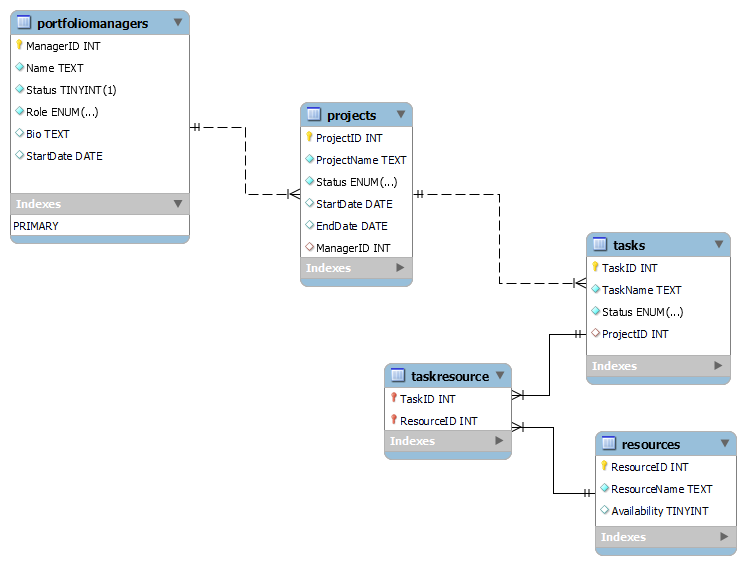

<h1>
  Introduction
</h1>

  This project is a web application for managing projects and tasks. It provides a user-friendly interface for managers to view   and update project details, assign resources to tasks, and track project progress. The application allows managers to create,   read, update, and delete projects and tasks, making it a comprehensive tool for project management.

<h1>
  Features
</h1>

<ul>
  <li>
    View a list of projects assigned to the manager
  </li>
  <li>
    View project details, including name, status, start date, and due date
  </li>
   <li>
    Update the status of a project (e.g., from "Not Started" to "In Progress" or "Completed")
  </li>
   <li>
    View a list of tasks associated with a selected project
  </li>
  <li>
   Create new tasks for a project
  </li>
  <li>
    Update the status of tasks (e.g., mark them as "Completed")
  </li>
   <li>
    Assign resources to tasks for project execution
  </li>
   <li>
    Calculate and display project completion progress as a percentage
  </li>
</ul>

<h1>
  Installation
</h1>

  1.Clone the Repository:  
    --git clone https://github.com/Surya0297/PortfolioManager.git 
  2. Navigate The ProjectDirectory: 
    --cd PortfolioManager 
  3.Install the required dependencies: 
    --npm install 

<h1>
  Usage
</h1>

  1.Run the development server: 
    --npm run serve 
  2.Open the application in your web browser: 
    --http://localhost:8080
 

<h1>
 API Endpoints
</h1>

<ul>
  <li>
   /manager/login: POST - Login endpoint for managers. Expects username and password fields in the request body.
  </li>
  <li>
    /manager/projects/:manager_id: GET - Retrieve a list of projects assigned to a manager.
  </li>
   <li>
    /projects/:project_id: GET - Retrieve project details by project ID.
   <li>
    /projects/:project_id: PUT - Update project details. Expects project details in the request body.
 </li>
  <li>
   /tasks/project/:project_id: GET - Retrieve tasks for a specific project.
  </li>
  <li>
   /tasks/:task_id: PUT - Update task details. Expects task details in the request body.
  </li>
</ul>

<h1>
Technologies Used
</h1>

<ul>
  <li>
   Vue.js: Frontend JavaScript framework for building user interfaces.
  </li>
  <li>
    MongoDB: NoSQL database for data storage.
  </li>
   <li>
    Axios: Promise-based HTTP client for making API requests.
   <li>
   JWT (JSON Web Tokens): For user authentication and authorization.
 </li>
  <li>
   HTML
  </li>
  <li>
  CSS
  </li>
  <li>
  Python
  </li>
</ul>

<h1>
  Contributing
</h1>

  Contributions are welcome! If you find any issues or have suggestions for improvements, please feel free to create a pull request or raise an issue on the GitHub repository.

<h1>
  Entity Relationship
</h1>

<h1>
 Screenshots
</h1>
<h2>Landiong Page</h2>

<h2>Admin DashBoard</h2>

<h2>Managers DashBoard</h2>

